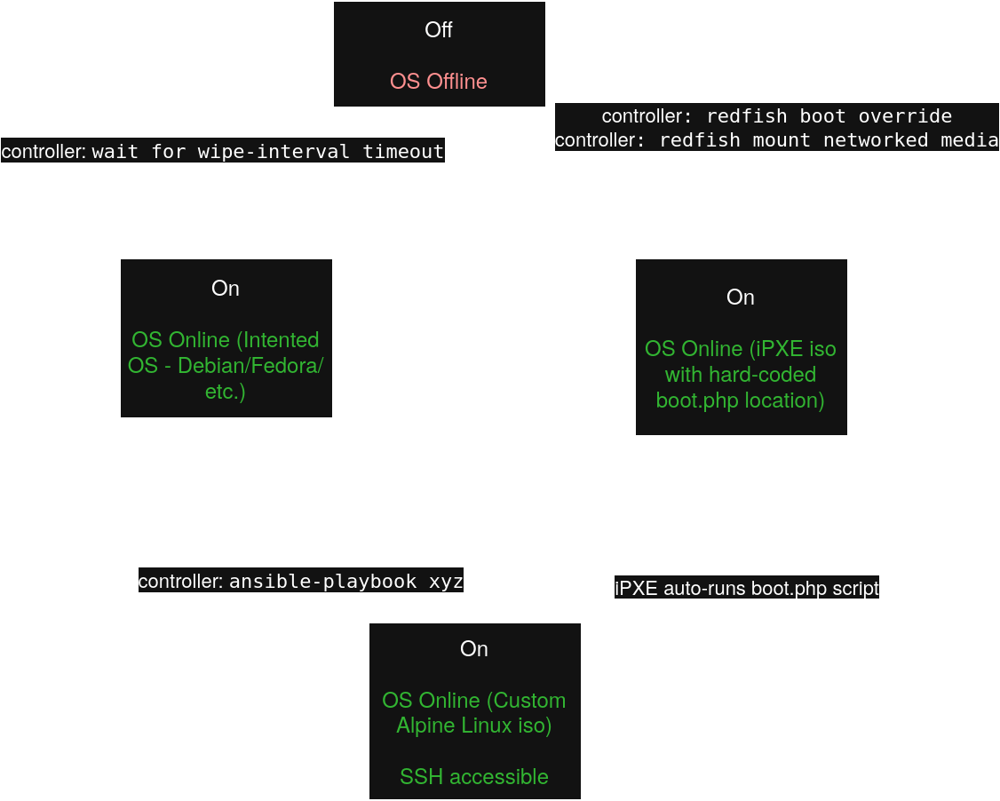

# Table of Contents

[API Docs](api/README.md)

# Example Command for Debugging

```sh
URL=https://192.168.0.230 USERNAME=Administrator PASSWORD=A0F7HKUU VALIDCERT=false WIPEINTERVAL=300 go run .
```

## Logical Flow



## How to Use This

1. Building (NOTE: Ensure you are running the scripts from the `deploy/scripts` directory as they use relative paths)
  - Building ipxe.iso image
    - Use new/existing iPXE config file in `deploy/build/ipxe/scripts`
    - Input its name as FILE variable in `deploy/scripts/build-ipxe-iso.sh`
    - Run `deploy/scripts/build-ipxe-iso.sh`
    - `ipxe.iso` is placed in `deploy/serve/www`
  - Building alpine-netboot image
    - Run `deploy/scripts/build-alpine.sh`
    - Files are placed in `deploy/serve/www/iso`
  - ssh-keys
    <!-- - Place intended public SSH key into `build/ssh-key` -->
    - TODO
2. Run stack
  - Ensure the files are correctly placed from step 1
  - `podman compose up -d` in repository root
3. !! VM FOR TESTING !!
  - Ensure `qemu` is installed and runnable
  - Ensure web server is accessible at \<machine-ip\>:8080
  - `qemu-system-x86_64 -cdrom <ipxe.iso> -net nic -net user,hostfwd=tcp::2223-:22 -m 3072 -smp $(nproc)`


# Bazinga

```
 ____            _
| __ )  __ _ ___(_)_ __   __ _  __ _
|  _ \ / _` |_  / | '_ \ / _` |/ _` |
| |_) | (_| |/ /| | | | | (_| | (_| |
|____/ \__,_/___|_|_| |_|\__, |\__,_|
                        |___/
```
