# Setup from blank server

Purpose: Provision a blank server using automatin and minimal hands-on intevention so that servers may be treated as disposable (aka cattle not pets).

- [Deploy VPN](https://github.com/KarmaComputing/server-bootstrap/tree/main/vpn-client#readme)
- [Add VPN user](https://github.com/KarmaComputing/server-bootstrap/tree/main/vpn-client#to-add-a-new-user-to-vpn)

# How does this work?

```mermaid


flowchart TD
    A[Day 0] --> B(Rack Server)
    B --> |Ensure management port  iDRAC connected & two NICs for uplink diversity| C("Deploy VPN 🔗 (Automated 😀👌)")
    C --> D("Deploy VPN user(s) 🔗 (Automated ✅)")
    D --> | Verify VPN connection to iDRAC| E("Visit iDRAC interface & Login (Manual🤮)")
    click C href "https://github.com/KarmaComputing/server-bootstrap/blob/main/vpn-client/README.md" "Deploy VPN Docs"
    click D href "https://github.com/KarmaComputing/server-bootstrap/blob/main/vpn-client/README.md" "Deploy VPN Docs"
    E --> F("In setup, set 'First Boot Device' to 'Virtual CD/DVD/ISO' (Manual🤮)")
    F --> G("Launch Virtual Console (Manual🤮)")
    G --> |"Latest virtual media hosted at <a href='https://github.com/KarmaComputing/server-bootstrap/releases/latest/download/ipxe.iso'>github.com/KarmaComputing/server-bootstrap/releases/latest/download/ipxe.iso</a>"| H("Connect Virtual Media CD & map device (Manual🤮) 🔗")
    click H href "https://github.com/KarmaComputing/server-bootstrap/releases/latest/download/ipxe.iso" "Deploy VPN Docs"
    H --> I("Power Cycle System (cold boot) (Manual🤮)")
    I --> |"iPXE will bootstrap into Alpine Linux & start sshd (see <a href='https://boot.karmacomputing.co.uk/boot.txt'>boot.karmacomputing.co.uk/boot.txt</a>) - a link to that script is <em>embeded</em> in ipxe.iso (it is a <a href='https://ipxe.org/scripting'>iPXE script</a>) "| J("Switch back to Virtual Console to observe boot process (Automated ✅)")
    J --> K("Verify server has iPXE booted into Alpine Linux by viewing Virtual Console (Manual🤮)")
    K --> L("Verify ssh access: From another host, ssh into the server using the injected `ssh_key` pair (Manual🤮)")
    L --> M("Run ansible playbook to bootstrap server persistant install (Manual OpenZFS Docs)  🔗")
   click M href "https://openzfs.github.io/openzfs-docs/Getting%20Started/Fedora/Root%20on%20ZFS.html" "Install ZFS root Fedora"

```



## [Web-UI](/src/web-ui#setup)

See [Web-ui](/src/web-ui#setup)

## iPXE

> For testing locally it's helpful to have quemu installed:
  `sudo apt install qemu`

```
git clone https://github.com/ipxe/ipxe
cd ipxe/src
git checkout c1834f323f4f6b9b46cd5895b1457a117381363f
```

Enable ping
```
sed -i 's$//#define PING_CMD$#define PING_CMD$' config/general.h
```

Enable https

Edit `config/general.h` and ensure: `#define DOWNLOAD_PROTO_HTTPS        /* Secure Hypertext Transfer Protocol */`

See https://ipxe.org/buildcfg/download_proto_https 


Embed the demo iPXE boot script
```
cat <<EOT > demo.ipxe
#!ipxe
dhcp
chain http://boot.ipxe.org/demo/boot.php
EOT
```

Build iPXE whilst embeding the iPXE script:

```
make EMBED=demo.ipxe # This will take quite a long time (over 5 mins)
```

The built ipxe ISO will then be inside folder:
```
bin/ipxe.iso
```

Test:

```
qemu-system-x86_64 -cdrom bin/ipxe.iso -nographic
```

1. iDrac to server for inital user set-up

> The rest will be done via playbook, this manual step is sadly needed to create the inital user (TODO perform via RedfishAPI + playwright see https://blog.karmacomputing.co.uk/devops-with-physical-servers-redfish-python-api-idrac/ and also https://github.com/microsoft/playwright/issues/21786#issuecomment-1481488488)
	set boot device to virtual cd
	launch virtual console
	attach virtual media (debian 11 live cd)
	wait for debian live to load
	create non-root user called debian
	
Install ssh

```
sudo -i
apt install -y openssh-server jq vim sshpass
```
Create debian user (a non-root user)

```
adduser debian
# set password
```

Add `debian` user to sudo group

```
usermod -aG sudo debian
```

Allow password authentication

```
sed -i 's/.*PasswordAuthentication.*/PasswordAuthentication yes/g' /etc/ssh/ssh_config
```

Restart sshd

```
systemctl restart sshd
```

Exit iDrac and attemp to connect over SSH to debian live running on server from your laptop/server.

```
ssh debian@<server-ip> # Not the iDRAC ip, your servers ethernet assigned ip
```

> If you don't know the up address of the server, check `ip -c a` and look at the links address(es)

Verify you can become root after SSH'ing into the server.
e.g.:

```
user@laptop ~ $ ssh debian@<ip>
Warning: Permanently added '<ip>' (ED25519) to the list of known hosts.
debian@<ip>'s password: 
Linux debian 5.10.0-20-amd64 #1 SMP Debian 5.10.158-2 (2022-12-13) x86_64

The programs included with the Debian GNU/Linux system are free software;
the exact distribution terms for each program are described in the
individual files in /usr/share/doc/*/copyright.

Debian GNU/Linux comes with ABSOLUTELY NO WARRANTY, to the extent
permitted by applicable law.
Last login: Fri Mar 24 23:49:21 2023 from x
debian@debian:~$ sudo -i
[sudo] password for debian: 
root@debian:~# whoami 
root
exit
```

> Exit out of the server, we run the ansible playbook from another host which has conectivity to the new server. We do not run ansible directly on the server.

Add to `inventory.yaml` with the new servers (possibly temporary) ip address.
	
2. Run playbook against server

Create python venv and install ansible
```
cd src
python3 -m venv venv
. venv/bin/activate
pip install -r ../requirements.txt 
```

Ensure `sshpass` is installed

> This is to verify initial access, before we put key based access in place

```
sudo apt install -y sshpass
```

Verify access using the `debian` password you created earlier and have added to `inventory.yaml`

```
ansible -i inventory.yaml -m ping <new-server-ip> -k
```

Expected output:

```
SSH password: 
<ip> | SUCCESS => {
    "ansible_facts": {
        "discovered_interpreter_python": "/usr/bin/python3"
    },
    "changed": false,
    "ping": "pong"
}
```

## Install / boostrap server by running playbook

```
ansible-playbook -vvv -i inventory.yaml playbooks/servers.yaml -k -K
```

## Turn on HBO mode (convert to non-raid)
In the iDRAC, see `convert-to-hba-mode.png`

> You must apply the operation "at next reboot" you can't apply hba mode whilst booted.


### View all SCSI disks

```
# The -S is to only show scsi (see `man lsblk`)
lsblk -S -o type,name,label,partlabel,size,model,serial,wwn,uuid
```

- Get disks serial numbers, ordered by slot number
  ```
  lsblk --json -S -o type,name,label,size,model,serial,wwn,uuid | jq -r '.blockdevices[] | select(.type=="disk") | .serial'
  ```
  Get first two disks serial numbers:
  ```
  lsblk --json -S -o type,name,label,size,model,serial,wwn,uuid | jq -r '.blockdevices[] | select(.type=="disk") | .serial' | head -2
  ```

get first disk

```
. ./get-first-disk-id.sh

# Clear partition table
sgdisk --zap-all $DISK


# Partition your disk(s):
sgdisk -a1 -n1:24K:+1000K -t1:EF02 $DISK
# Set Unencrypted or ZFS native encryption:
sgdisk     -n4:0:0        -t4:BF00 $DISK
```

Repeat above for disk 2.

### Create the boot pool
Create zpool mirror:

```
zpool create \
    -o ashift=12 \
    -o autotrim=on -d \
    -o cachefile=/etc/zfs/zpool.cache \
    -o feature@async_destroy=enabled \
    -o feature@bookmarks=enabled \
    -o feature@embedded_data=enabled \
    -o feature@empty_bpobj=enabled \
    -o feature@enabled_txg=enabled \
    -o feature@extensible_dataset=enabled \
    -o feature@filesystem_limits=enabled \
    -o feature@hole_birth=enabled \
    -o feature@large_blocks=enabled \
    -o feature@livelist=enabled \
    -o feature@lz4_compress=enabled \
    -o feature@spacemap_histogram=enabled \
    -o feature@zpool_checkpoint=enabled \
    -O devices=off \
    -O acltype=posixacl -O xattr=sa \
    -O compression=lz4 \
    -O normalization=formD \
    -O relatime=on \
    -O canmount=off -O mountpoint=/boot -R /mnt \
    bpool \
    /dev/disk/by-id/scsi-SATA_disk1-part3 \
    /dev/disk/by-id/scsi-SATA_disk2-part3
```

### Create the root pool

> Unencrypted

```
zpool create \
    -o ashift=12 \
    -o autotrim=on \
    -O acltype=posixacl -O xattr=sa -O dnodesize=auto \
    -O compression=lz4 \
    -O normalization=formD \
    -O relatime=on \
    -O canmount=off -O mountpoint=/ -R /mnt \
    rpool mirror /dev/disk/by-id/scsi-SATA_disk1-part4 /dev/disk/by-id/scsi-SATA_disk2-part4
```

e.g. where `DISK1` is /dev/disk/by-id/ata-SK_segate-2u3u8389233-part4


### System Installation ([ref](https://openzfs.github.io/openzfs-docs/Getting%20Started/Debian/Debian%20Bullseye%20Root%20on%20ZFS.html#step-3-system-installation))

Create filesystem datasets to act as containers:
```
zfs create -o canmount=off -o mountpoint=none rpool/ROOT
zfs create -o canmount=off -o mountpoint=none bpool/BOOT
```

Create filesystem datasets for the root and boot filesystems:
```
zfs create -p -o canmount=noauto -o mountpoint=/ rpool/ROOT/debian
zfs mount rpool/ROOT/debian

zfs create -p -o mountpoint=/boot bpool/BOOT/debian
```

### Create datasets:
```
zfs create                     rpool/home
zfs create -o mountpoint=/root rpool/home/root
chmod 700 /mnt/root
zfs create -o canmount=off     rpool/var
zfs create -o canmount=off     rpool/var/lib
zfs create                     rpool/var/log
zfs create                     rpool/var/spool
```

(Optional datasets)
```
zfs create -o com.sun:auto-snapshot=false rpool/var/cache
zfs create -o com.sun:auto-snapshot=false rpool/var/lib/nfs
zfs create -o com.sun:auto-snapshot=false rpool/var/tmp
chmod 1777 /mnt/var/tmp
```


### Mount a tmpfs at /run:

```
mkdir /mnt/run
mount -t tmpfs tmpfs /mnt/run
mkdir /mnt/run/lock
```

### Install the minimal system
```
debootstrap bullseye /mnt
```

### Copy in zpool.cache:

```
mkdir /mnt/etc/zfs
cp /etc/zfs/zpool.cache /mnt/etc/zfs/
```

### System Configuration

Configure the hostname:
```
hostname CHANGEME
hostname > /mnt/etc/hostname
vi /mnt/etc/hosts
```

```
Add a line:
127.0.1.1       HOSTNAME
or if the system has a real name in DNS:
127.0.1.1       FQDN HOSTNAME
```
Configure the network interface:

```
ip addr show
```
```
vi /mnt/etc/network/interfaces.d/NAME
```
```
auto NAME
iface NAME inet dhcp
```

Configure the package sources:

`vi /mnt/etc/apt/sources.list`

```
deb http://deb.debian.org/debian bullseye main contrib
deb-src http://deb.debian.org/debian bullseye main contrib

deb http://deb.debian.org/debian-security bullseye-security main contrib
deb-src http://deb.debian.org/debian-security bullseye-security main contrib

deb http://deb.debian.org/debian bullseye-updates main contrib
deb-src http://deb.debian.org/debian bullseye-updates main contrib
```

### Bind the virtual filesystems from the LiveCD environment to the new system and chroot into it:

```
DISK=/dev/disk/by-id/SATA_disk1
```

```
mount --make-private --rbind /dev  /mnt/dev
mount --make-private --rbind /proc /mnt/proc
mount --make-private --rbind /sys  /mnt/sys
chroot /mnt /usr/bin/env DISK=$DISK bash --login
```

### Configure a basic system environment:

```
ln -s /proc/self/mounts /etc/mtab
apt update

apt install --yes console-setup locales
```

Even if you prefer a non-English system language, always ensure that en_US.UTF-8 is available:

```
dpkg-reconfigure locales tzdata keyboard-configuration console-setup
```

Install ZFS in the chroot environment for the new system:

```
apt install --yes dpkg-dev linux-headers-generic linux-image-generic
apt install --yes zfs-initramfs
echo REMAKE_INITRD=yes > /etc/dkms/zfs.conf
```
> Note: Ignore any error messages saying ERROR: Couldn't resolve device and WARNING: Couldn't determine root device. cryptsetup does not support ZFS.

Install an NTP service to synchronize time. 

```
apt install systemd-timesyncd
timedatectl
```

Install GRUB
```
apt install --yes grub-pc
```

Optional: Remove os-prober:
```
apt purge --yes os-prober
```

### Set root password
```
passwd
```

Enable importing bpool

> This ensures that bpool is always imported, regardless of whether /etc/zfs/zpool.cache exists, whether it is in the cachefile or not, or whether zfs-import-scan.service is enabled.

`vi /etc/systemd/system/zfs-import-bpool.service`

```
[Unit]
DefaultDependencies=no
Before=zfs-import-scan.service
Before=zfs-import-cache.service

[Service]
Type=oneshot
RemainAfterExit=yes
ExecStart=/sbin/zpool import -N -o cachefile=none bpool
# Work-around to preserve zpool cache:
ExecStartPre=-/bin/mv /etc/zfs/zpool.cache /etc/zfs/preboot_zpool.cache
ExecStartPost=-/bin/mv /etc/zfs/preboot_zpool.cache /etc/zfs/zpool.cache

[Install]
WantedBy=zfs-import.target
```

`systemctl enable zfs-import-bpool.service`


Optional: Install SSH:

```
apt install --yes openssh-server
apt install --yes openssh-server

vi /etc/ssh/sshd_config
# Set: PermitRootLogin yes
```

Optional (but kindly requested): Install popcon

```
apt install --yes popularity-contest
```

### GRUB Installation

Verify that the ZFS boot filesystem is recognized:

```
grub-probe /boot
```

Refresh the initrd files:
```
update-initramfs -c -k all
```
> Note: Ignore any error messages saying ERROR: Couldn't resolve device and WARNING: Couldn't determine root device. cryptsetup does not support ZFS.

Workaround GRUB’s missing zpool-features support:

```
vi /etc/default/grub
# Set: GRUB_CMDLINE_LINUX="root=ZFS=rpool/ROOT/debian"
```

Optional (but highly recommended): Make debugging GRUB easier:

```
vi /etc/default/grub
# Remove quiet from: GRUB_CMDLINE_LINUX_DEFAULT
# Uncomment: GRUB_TERMINAL=console
# Save and quit.
```

Update the boot configuration:
```
update-grub
```
> Note: Ignore errors from osprober, if present.

Install the boot loader:

For legacy (BIOS) booting, install GRUB to the MBR:
```
grub-install $DISK
```
e.g:
```
grub-install /dev/disk/by-id/SATA_disk1
Installing for i386-pc platform.
grub-install /dev/disk/by-id/SATA_disk2
```
> Remember, If you are creating a mirror or raidz topology, repeat the grub-install command for each disk in the pool.

Fix filesystem mount ordering:

```
mkdir /etc/zfs/zfs-list.cache
touch /etc/zfs/zfs-list.cache/bpool
touch /etc/zfs/zfs-list.cache/rpool
zed -F &
```

Verify that zed updated the cache by making sure these are not empty:

```
cat /etc/zfs/zfs-list.cache/bpool
cat /etc/zfs/zfs-list.cache/rpool
```

If either is empty, force a cache update and check again:
```
zfs set canmount=on     bpool/BOOT/debian
zfs set canmount=noauto rpool/ROOT/debian
```

Fix the paths to eliminate /mnt:
```
sed -Ei "s|/mnt/?|/|" /etc/zfs/zfs-list.cache/*
```

## First boot

Optional: Snapshot the initial installation:
```
zfs snapshot bpool/BOOT/debian@install
zfs snapshot rpool/ROOT/debian@install
```

Exit from the chroot environment back to the LiveCD environment:

```
exit
```

Run these commands in the LiveCD environment to unmount all filesystems:

```
mount | grep -v zfs | tac | awk '/\/mnt/ {print $3}' | \
    xargs -i{} umount -lf {}
zpool export -a
```


# Ref
https://openzfs.github.io/openzfs-docs/Getting%20Started/Debian/Debian%20Bullseye%20Root%20on%20ZFS.html#id8:~:text=Partition%20your%20disk(s)%3A
