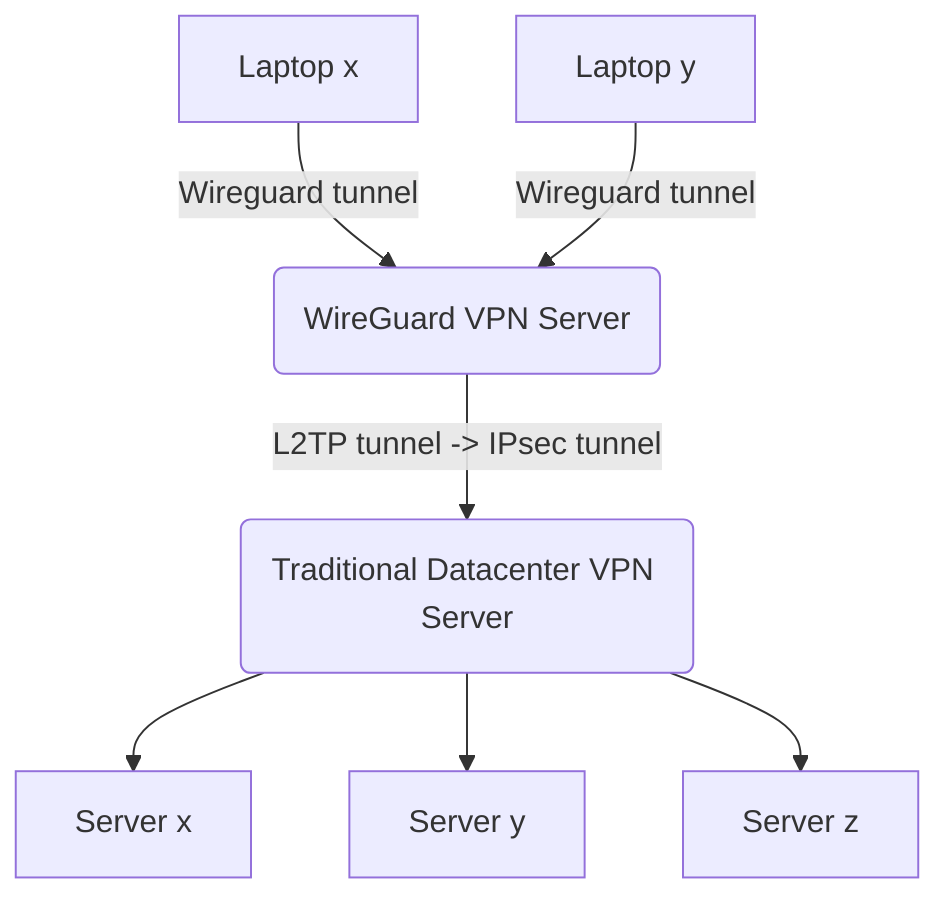

# VPN Client & VPN Server (IPsec client & Wireguard Server)

Setup & deploy a IPsec VPN tunnel client on Ubuntu server.

## How does it work and what does it do?


The above diagram (<sub><sup>See [mermaid.live](https://mermaid.live/)</sub></sup>) is also a small lie: at time of writing only _one_ client is created but peer creation is [very]([url](https://www.youtube.com/watch?v=88GyLoZbDNw)) [simple](https://github.com/KarmaComputing/server-bootstrap/blob/43053816a72d801fbf525c59c0a2eccc149a05d0/vpn-client/playbooks/deploy-vpn-client.yml#L143).


## Deploying manually

### Configure
```
python3 -m venv venv
. venv/bin/activate
pip install -r requirements.txt
```

> The VPN client & VPN Server deployment is completely* [pipeline driven](https://github.com/KarmaComputing/server-bootstrap/blob/43053816a72d801fbf525c59c0a2eccc149a05d0/.github/workflows/deploy-vpn.yml#L64). But you can also 'break glass' and run the process locally:

*Except for the server creation- to run the deploy-vpn pipeline you first need to create a small VPS and populate the needed pipline secret `VPN_SSH_PRIVATE_KEY` in [settings](https://github.com/KarmaComputing/server-bootstrap/settings/secrets/actions).

1. Update `inventory.ini`
2. Run playbook (below)

```
python3 -m venv venv
. venv/bin/activate
ansible-playbook --ask-vault-pass --ask-become-pass -i inventory.ini playbooks/deploy-vpn-client.yml 
```

Where `BECOME` is local admin password (to place client wiregard config file), and `Vault password` is password to unlock vault.

## Verify

```
# on the server
curl -v -k -L --compressed https://10.100.49.2
```

## How do I connect as a client?
> Both cli and gui methods are supported- including mobile 📱

- Linux / Ubuntu / Debian: Use `wg-quick` (easiest)
- (ubuntu desktop) use the [network-manager-gui](https://www.xmodulo.com/wireguard-vpn-network-manager-gui.html#:~:text=NetworkManager%27s%20Connection%20Editor-,GUI,-Next%2C%20run%20nm
)
- Mobile: [Android](https://play.google.com/store/apps/details?id=com.wireguard.android) / [IOS](https://itunes.apple.com/us/app/wireguard/id1441195209?ls=1&mt=8)
- Read https://www.wireguard.com/install/


see also: https://askubuntu.com/questions/1457052/cant-add-wireguard-vpn-connection-to-ubuntu-network-manager#:~:text=s%20GUI%20as-,described,-here.
