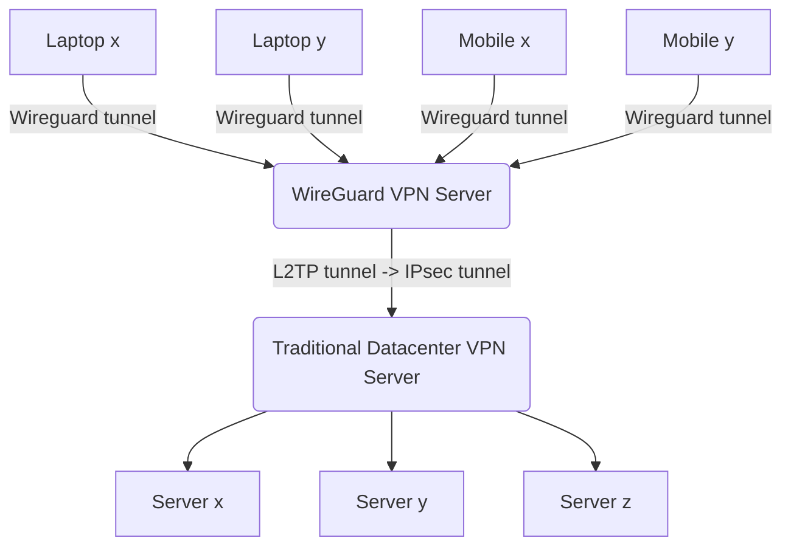

# VPN Client & VPN Server (IPsec client & Wireguard Server)

> Known bug: Did your VPN mysteriously stop working?
> Check for interface `ppp0` on the vpn server.
> I think the ipsec tunner automatically turns of / goes away (this is a thing in ipSec tunnels) so need to enhance to keep it up/check for this/configure as required. 

Setup & deploy a IPsec VPN tunnel client on Ubuntu server. 

This is useful for when you want to securly connect to a traditional IPsec VPN* but you're willing to complicate matters for the benfit of your users:  By putting wireguard infront of the IPsec VPN,  this can make connecting to such VPNs 'effortless' for end users given Wireguard is comparatively simple for end users to configure, and even has support for mobile app clients 📱.

_*which you may not have a lot of control or say over the running of._

# Quickstart

### To re-deploy VPN server/client from scratch

1. Create Ubuntu server (Ubuntu 20.04 has been tested)
2. Run [Deploy VPN Client pipeline](https://github.com/KarmaComputing/server-bootstrap/actions/workflows/deploy-vpn.yml) to deploy IPsec and Wireguard tunnel

### To add a new user to VPN:
1. Create new 'note' secret in Psono (e.g. 'Alice VPN config')
2. Give permission for Psono API key to access this new secret ([see psono docs](https://doc.psono.com/user/api-key/creation.html#creation)) & copy the secret id to clipboard
3. Run [Add VPN user pipeline](https://github.com/KarmaComputing/server-bootstrap/actions/workflows/add-vpn-user.yml) which will generate valid VPN credentials and put them in the Psono secret for that use to view
4. The user can use that VPN credential to connect to the vpn using Wireguard client (laptop/mobile/ios/android) see [clients](https://www.wireguard.com/install/)
> Tip: For mobile, you can easily generate a qr code of the config to make the process of importing VPN config even easier for the end users on mobile: `cat <config> | qrencode -t ansiutf8`

## How does it work and what does it do?


<sub><sup>See [mermaid.live](https://mermaid.live/)</sub></sup> For more background info on Wireguard see [here](https://www.youtube.com/watch?v=88GyLoZbDNw) and [here](https://github.com/KarmaComputing/server-bootstrap/blob/43053816a72d801fbf525c59c0a2eccc149a05d0/vpn-client/playbooks/deploy-vpn-client.yml#L143).


## Deploying manually

### Configure
```
python3 -m venv venv
. venv/bin/activate
pip install -r requirements.txt
```

> The VPN client & VPN Server deployment is completely* [pipeline driven](https://github.com/KarmaComputing/server-bootstrap/blob/43053816a72d801fbf525c59c0a2eccc149a05d0/.github/workflows/deploy-vpn.yml#L64). But you can also 'break glass' and run the process locally:

*Except for the server creation- to run the deploy-vpn pipeline you first need to create a small VPS and populate the needed pipline secret `VPN_SSH_PRIVATE_KEY` in [settings](https://github.com/KarmaComputing/server-bootstrap/settings/secrets/actions).

1. Update `inventory.ini`
2. Run playbook (below)

```
python3 -m venv venv
. venv/bin/activate
ansible-playbook --ask-vault-pass --ask-become-pass -i inventory.ini playbooks/deploy-vpn-client.yml 
```

Where `BECOME` is local admin password (to place client wiregard config file), and `Vault password` is password to unlock vault.

## Verify

```
# on the server
curl -v -k -L --compressed https://10.100.49.2
```

## How do I connect as a client?
> Both cli and gui methods are supported- including mobile 📱

- Linux / Ubuntu / Debian: Use `wg-quick` (easiest)
  - After placing your config in `/etc/wireguard/wg0.conf` you typically run `sudo wg-quick up wg0` to start the vpn connection
- (ubuntu desktop) use the [network-manager-gui](https://www.xmodulo.com/wireguard-vpn-network-manager-gui.html#:~:text=NetworkManager%27s%20Connection%20Editor-,GUI,-Next%2C%20run%20nm
)
- Mobile: [Android](https://play.google.com/store/apps/details?id=com.wireguard.android) / [IOS](https://itunes.apple.com/us/app/wireguard/id1441195209?ls=1&mt=8)
- Read https://www.wireguard.com/install/


### See also
- https://askubuntu.com/questions/1457052/cant-add-wireguard-vpn-connection-to-ubuntu-network-manager#:~:text=s%20GUI%20as-,described,-here.
- https://ubuntu.com/server/docs/wireguard-vpn-peer2site-router
